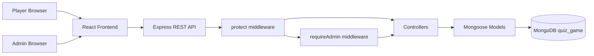
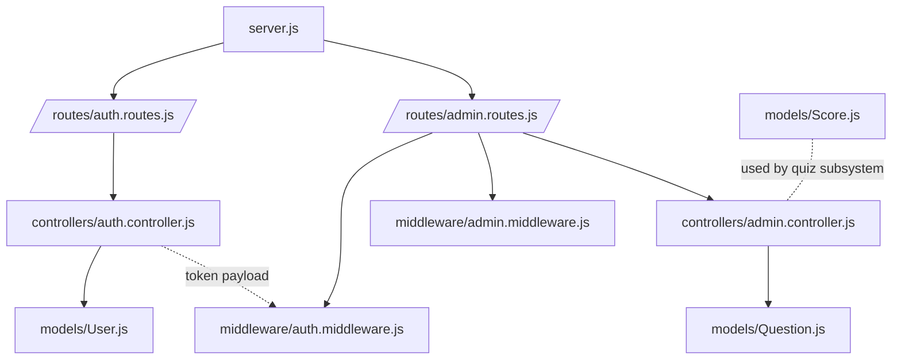
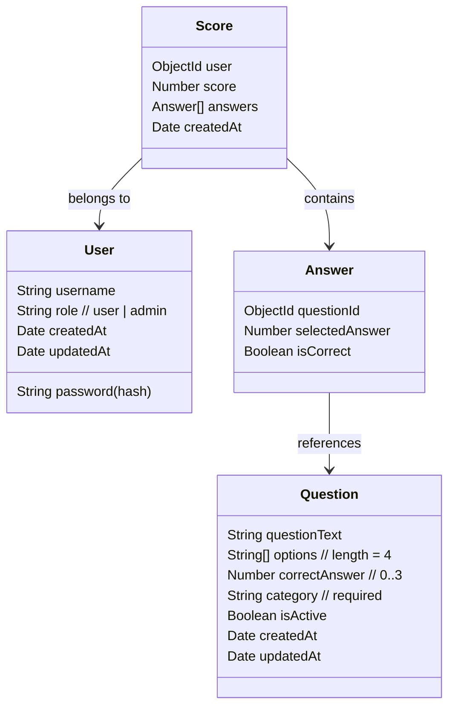
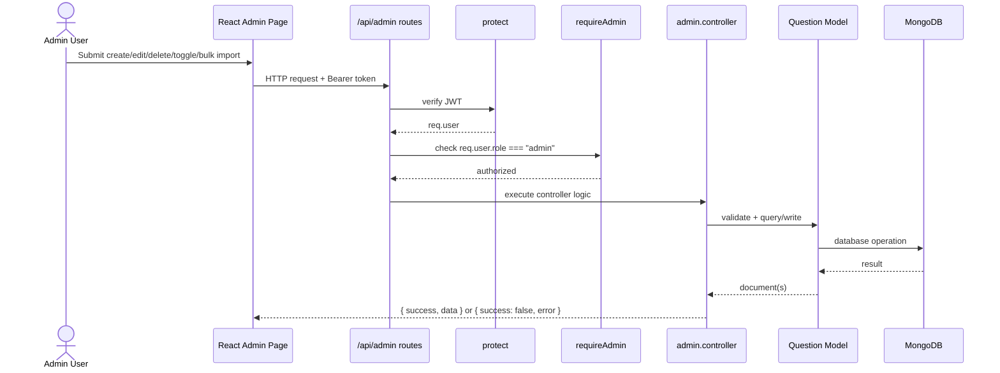

# System Architecture

## Purpose
This document describes the architecture of the COMP5347 Assignment 2 quiz game.
It explains the frontend-backend-database structure, auth and admin access control, and the `Categorised quizzes` variation design.

## High-Level Architecture

## Backend Module Structure

## Data Model (Current Contract)

## Request Flow: Admin CRUD

## Variation Integration: Categorised Quizzes
- `category` is a required field in `Question`.
- Admin create/edit/bulk-import all validate `category`.
- Quiz subsystem only fetches active questions from selected category.
- This design enforces the assignment requirement at both data and API layers.

## Security Notes
- Passwords are hashed with `bcrypt`.
- JWT is required for protected endpoints.
- Admin APIs enforce role-based access in backend middleware.
- API response envelope is consistent: `{ success, data?, error? }`.
